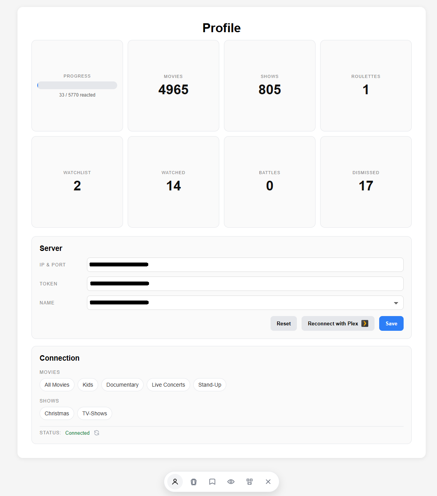
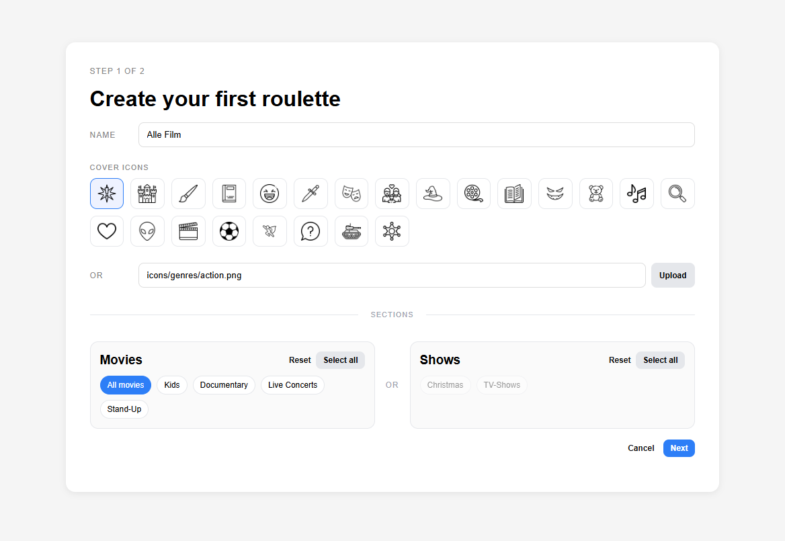
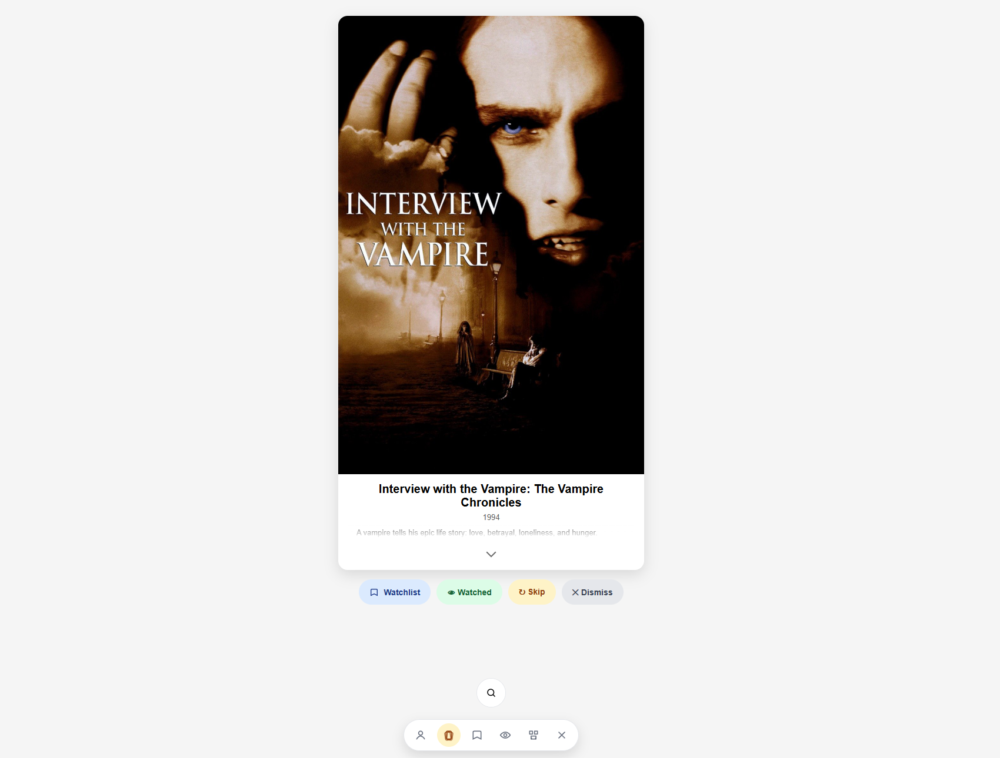
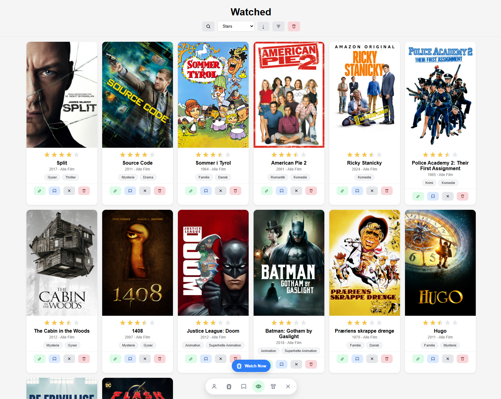
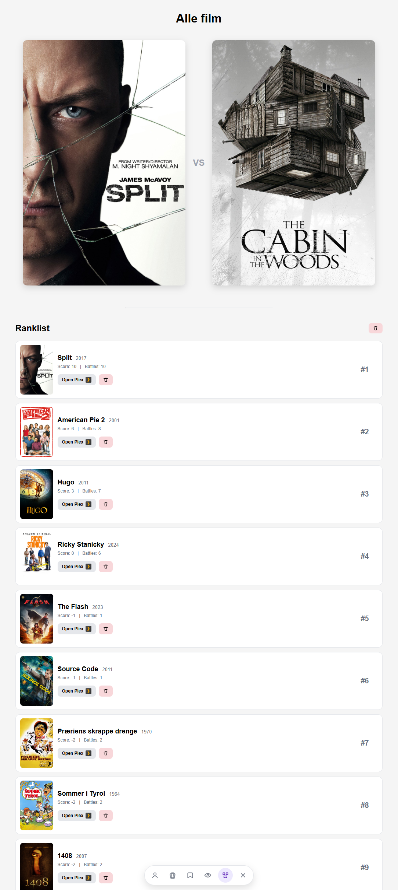

# Watchulater Local


A local-first Plex companion app that helps you decide what to watch next.  
No cloud account, no hosted backend - everything runs locally on your machine.

## What you get

- Plex onboarding (PIN login + server selection)
- Roulette flow (watchlist / watched / dismissed / skip)
- Watchlist, Watched, Dismissed with filter/sort/search
- Watch Now flow from your filtered list
- Battles with live ranking between watched titles
- Single-user local setup with SQLite

## Feature matrix

| Feature | Status | What it does | Notes |
|---|---|---|---|
| Onboarding + Plex link | Done | Guides first-time setup and links Plex account | PIN flow + manual token fallback |
| Plex server selection | Done | Lets user select and save Plex server connection | Supports reconnect/reset flow |
| Roulette flow | Done | Shows one title at a time with decision actions | Skip, watchlist, watched, dismissed |
| List management | Done | Manages Watchlist, Watched, and Dismissed lists | Filter, sort, search, quick move actions |
| Watch Now | Done | Builds a temporary watch session from visible filtered items | Local session flow, no persistent preset |
| Battles | Done | Head-to-head watched-title matchups with scoring | Winner/loser scoring + live rank list |
| Cover icons/gallery | Done | Lets user choose icon-based covers for presets | Optional custom cover URL/upload |
| Local DB auto-init | Done | Creates local SQLite DB automatically on first run | Uses `db/schema.sql` + `db/seed.sql` |
| Security hardening | Done | Protects state-changing endpoints | POST-only + CSRF token checks |

## Roadmap + status

### Now
- Stable local-first release is available on GitHub
- Core Plex onboarding and server selection are implemented
- Roulette, lists, Watch Now, and Battles are implemented
- Security baseline is in place (POST-only + CSRF checks)

### Next
- Test phase: collect real-world feedback, bug reports, and UX friction points
- Prioritize fixes and refinements based on tester feedback

### Later
- Add additional media integrations (for example Jellyfin, Letterboxd, and IMDb)
- Add import of Plex watchlist into local lists
- Add import of Plex ratings/stars into local watched data

## Screenshots

### Profile


### Create your first roulette


### Roulette view


### List view


### Battles view


## Requirements

- Windows (or adapt commands for macOS/Linux)
- PHP 8.x with:
  - `pdo_sqlite`
  - `curl`
  - `json`

## One-click setup

### Option A: Download ZIP
1. Click `Code` -> `Download ZIP` on GitHub
2. Extract the folder
3. Double-click `start_server.bat`

### Option B: Clone with Git
```powershell
git clone https://github.com/adultkips/watchulater-local.git
cd watchulater-local
```
Then double-click `start_server.bat`.

## Quick start (Windows)

1. Clone or download this repository
2. Double-click `start_server.bat` to start the local server

3. Open:

   `http://localhost:8000`

On first load, the app auto-creates `db/watchulater.db` from `db/schema.sql` + `db/seed.sql`.

## First-run setup

1. Open onboarding
2. Link Plex account (PIN flow or manual token)
3. Select Plex server
4. Finish setup and create your first roulette

## Troubleshooting

- **`php` not found**  
  Install PHP and confirm it is in PATH: `php -v`

- **Missing PHP extensions (`pdo_sqlite` / `curl`)**  
  Check enabled modules: `php -m`  
  Ensure `pdo_sqlite` and `curl` are enabled in your PHP installation.

- **404 on `/`**  
  Start the app by double-clicking `start_server.bat` from the project root folder (not from inside a subfolder).

- **Port 8000 already in use**  
  Edit `start_server.bat` and change `set PORT=8000` to another free port (for example `8080`), then open that port in browser.

- **Plex TLS/certificate errors**  
  Update `cacert.pem` from: https://curl.se/ca/cacert.pem

- **`method_not_allowed` on endpoints in browser**  
  Some endpoints are POST-only by design (security). This is expected if opened directly in browser.

- **Need a clean local reset**  
  Stop server, delete `db/watchulater.db`, start server again, then reload the app.

## Security / local data

- All runtime data is local
- SQLite DB: `db/watchulater.db` (git-ignored)
- `.env` is git-ignored
- CSRF protection is enabled for POST endpoints (cookie/session based)

## License

MIT - see [LICENSE](LICENSE).
